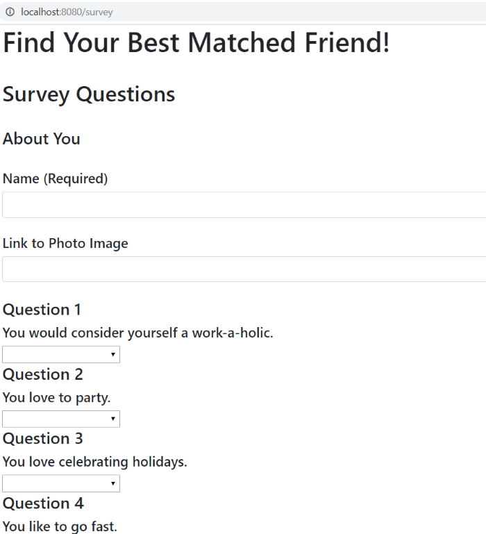
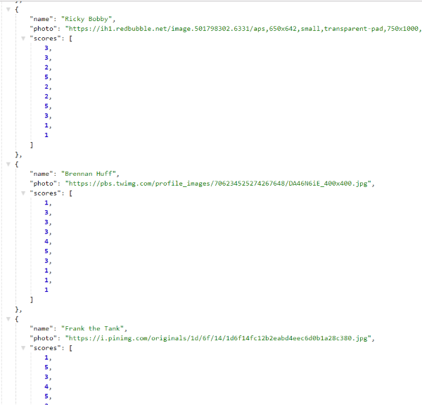

# FriendFinder

Welcome to my Friend Finder app.  It's purpose is to match you with a friend with your same interests.  Just fill out a short survey and it will calculate your results and show you the name and photo of your match.

### Instructions to use:

-Clone the repo
-Change the port in the server.js file if you don't want to use 8080
-Will need to npm install express and path in your command line
-Also in your command line type node server.js and make sure your port is listening
-Navigate to your web browser, and go to localhost:8080/home

-Click on go to survey and fill out each question

-Click submit and your results will be displayed!

  

-You can also see the api list of friend options

### Technologies Used:
-Node.js
-Express
-Routes
-JavaScript
-jQuery
